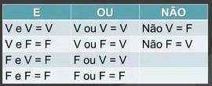

## Fundamentação básica do PHP

### O php é uma linguagem dinamica que tem o foco no desenvolvimento de aplicações web


### Configuração do código php
Para iniciar o desenvolvimento de projeto em php, é necessário fazer a criação da pasta 
do projeto a ser desenvolvido dentro do diretório `htdocs`, essa pasta fica em local 
diferente a depender do sistema operacional.

#### Para o Sistema Operacional Linux
- /opt/lampp/htdocs


#### Para o Sistema Operacional Windows
- C://xampp/htdocs


#### Uma Vez com essa pasta criada e carregada no seu editor de código por exemplo vscode, criaremos um arquivo chamado `index.php` que será desenvolvido o código em linguagem php.

## 

### O que vamos Aprender

- Conceitos básicos da linguagem
- <a href="#comentarios">As principais formas de comentár seu código</a>
- <a href="#variaveis_caracteristicas">O que é uma variável e suas caractéristicas</a>
- <a href="#tipos_primitivos">Os Principais Tipos Primitivos da Linguagem PHP</a>
- <a href="#operadores">Operadores</a>
    - <a href="https://www.php.net/manual/pt_BR/language.operators.logical.php" target="_blank">Lógicos</a>
    - <a href="https://www.php.net/manual/pt_BR/language.operators.arithmetic.php" target="_blank">Aritmetricos</a>
    - <a href="https://www.php.net/manual/pt_BR/language.operators.comparison.php" target="_blank">Comparação</a>


#### Conceitos básicos da linguagem Tag de Abertura e Fechamento
Uma vez o arquivo **index.php** todo código php desenvolvido vai dentro da tag de abertura e fechamento sua representação segue esta forma. 

```php
<?php 
    // aqui vai os comandos php
?>
```

#### <span id="comentarios">Conceitos básicos da linguagem: Adicionando comentário ao seu código PHP</span>
<p>Um comentário é uma alternativa que o programador tem para descrever o que partes do seu código esta fazendo</p>

```php
<?php 
    // comentário de uma única linha

    /*
        aqui posso comentar
        varias linha
        do meu código.

        com uma atenção 
        sempre se lembre de fecha o comentário
    */
?>
```

#### Como devemos escrever uma instrução de código php valida
no php é importante que saibamos como deve ser escrita a sintaxe do nosso código para evitar perdermos tempo com erro dificies de ser localizados

todo comando php seja declarando uma variavel, ou chamando uma função do php o caractere de `;` deve ser sempre usado para apontar ao php que aquela instrução ou comando foi finalizada e o que vem a frente nas próximas linhas deve ser interpretado com um novo comando. Vamos fazer um exemplo abaixo: 

```txt
    ESSA É UMA FORMA CORRETA
    $message = "meu texto";

    echo $message;

    -------------------------------------------

    ESSA É UMA FORMA ERRADA
    $message = "meu texto"

    echo $message
```

### <span id="variaveis_caracteristicas">O que é uma variável e suas caractéristicas</span>

<p>
Toda variável em PHP tem seu nome composto pelo carácter $(dólar) e uma string, que deve iniciar por
uma letra ou o caracter “_”. 
</p>

<p>O PHP é case sensitive, ou seja, as variáveis $vivas e $VIVAS são diferentes.</p>


#### Caractéristicas de uma variável

<ul>
    <li>Toda variável possui um nome</li>
    <li>Toda variavel possui um valor</li>
    <li>O nome de uma variável nunca deve começar com um número</li>
    <li></li>
</ul>

Veja exemplos de variáveis PHP

```php
<?php 
    // essa variável possui um tipo float e seu objetivo é armazena o salário
    $salario = 10000.00; 
    
    /* 
        Aqui o valor armazenado 
        é do tipo
        bool ou bolean
    */
    $status = false;

    /* 
        A variável $nomeDoCurso guarda 
        um texto no PHP esse
        texto seu valor é do tipo
        string 
    */
    $nomeDoCurso = "Formação Full-Stack em PHP";

    /* 
        A variável $quantidade tem o valor do tipo int 
    */
    $quantidade = 5031

    /*
        $numerosPares armazena vários valores do 
        tipo inteiro e possui 6 elementos armazenados
    */
    $numerosPares = [0, 2, 4, 6, 8, 10];

    /*
        veja outra forma de criar um array
        aqui vamos listar nomes de cidades,
        aqui foi adicionado o nome de 5 cidades
        
    */
    $cidades = [];
    $cidades[] = "Feira de Santana";
    $cidades[] = "Alagoinhas";
    $cidades[] = "Ilheus";
    $cidades[] = "Governador Mangabeira";
    $cidades[] = "Valença";

    // e para saber como ficou esses nomes
    // dentro da lista $cidade
    var_dump($cidade);


    // acessando os valores da lista pelo seu indice
    var_dump($cidade[0]); // "Feira de Santana"
    var_dump($cidade[1]); // "Alagoinhas"
    var_dump($cidade[2]); // "Ilheus"
    var_dump($cidade[3]); // "Governador Mangabeira"
    var_dump($cidade[4]); // "Valença"


    // um outro tipo que o php suporta é o object
    // um detalhe é que o stdClass que usamos é um de muito tipo de object que podemos usa-lo, vejamos um exemplo

    $produto = new stdClass();
    $produto->nome = "Mouse logi";
    $produto->categoria = "Informatica";
    $produto->valorUnitario = 100.000

    // podemos exibir esse objeto da seguinte forma
    echo "Informações do produto<br />";
    echo "Nome: $produto->nome";
    echo "Categoria: $produto->categoria";
    echo "Valor Unitário: $produto->valorUnitario";
?>
```


### <span id="tipos_primitivos">Os Principais Tipos Primitivos da Linguagem PHP</span>
O php não é muito diferente a outras linguagem quando se trata de tipos primitivos de dados aqui vamos ver os mais comun que são utilizados
- <a href="https://www.php.net/manual/pt_BR/language.types.integer.php" target="_blank">int</a> 
- <a href="https://www.php.net/manual/pt_BR/language.types.float.php" target="_blank">float</a> 
- <a href="https://www.php.net/manual/pt_BR/language.types.string.php" target="_blank">string</a> 
- <a href="https://www.php.net/manual/pt_BR/language.types.boolean.php" target="_blank">bool</a>
- <a href="https://www.php.net/manual/pt_BR/language.types.array.php" target="_blank">Array</a>
- <a href="https://www.php.net/manual/pt_BR/language.types.object.php" target="_blank">Objetos</a>
 

## <span id="operadores">Operadores</span>
### Operadores - Lógicos
Os operadores são elementos fundamentais quando se fala de linguagem de programação.
Eles permitem realizar operações de comparação e combinação de valores boleanos, ou seja, valores verdadeiros(true) ou falsos (false)

Existem 3 operadores lógico que são:
- Operador de negação "!"
- Operador AND
- Operador OR

#### Tabela Verdade: AND, OR e Negação(Não)



### Operadores - Aritmetricos
Os operadores aritmetricos são usado para fazer calculos matematicos com a linguagem php vamos ver alguns do operadores:
<p>[ + ] Adição</p>
<p>[ - ] Subtração</p>
<p>[ / ] Divisão</p>
<p>[ * ] Múltiplicação</p>
<p>[ % ] Modulo</p>
<p>[ ++ ] Incremento</p>
<p>[ -- ] Decremento</p>


### Operadores - Comparação
Os operadores de comparação possui o papel dentro da programação de gerar uma condição para que uma ação possa ser execultada, condição tem como resultado um valor boolean(true,false), com isso apontando qual foi o resultado da comparação, vejamos os comparadores usado no php.

- [ > ]  Maior que
- [ < ]  Menor que
- [ >= ] Maior ou igual
- [ <= ] Menor ou igual
- [ == ] Igual
- [ != ] Diferente

<p>vamos ilustra um exmplo pratico</p>


```php
<?php
    var_dump("PHP" == "PhP"); // isso resulta em: bool(false) 
    var_dump("Python" != "Java"); // isso resulta em: bool(true)

    /* 
        vamos imaginar que para realizar um saque da conta bancária,
        o caixa eletronico só permitirá se o valor for 
        menor ou igual à 1000 reais
    */
    var_dump(500 < 1000); // isso resulta em: bool(true)
    var_dump(500 <= 1000); // isso resulta em: bool(true)
    var_dump(1000 > 1000); // isso resulta em: bool(false)
    var_dump(1000 >= 1000); // isso resulta em: bool(true)

?>

```

