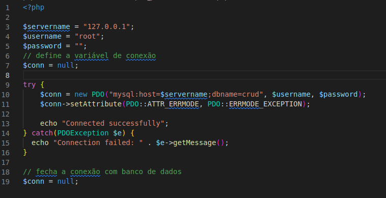
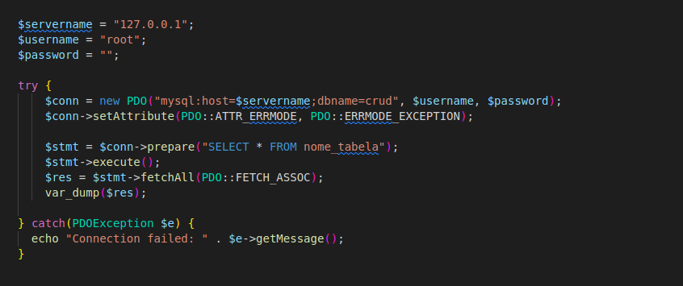
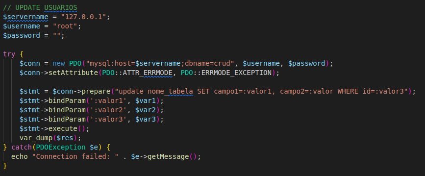
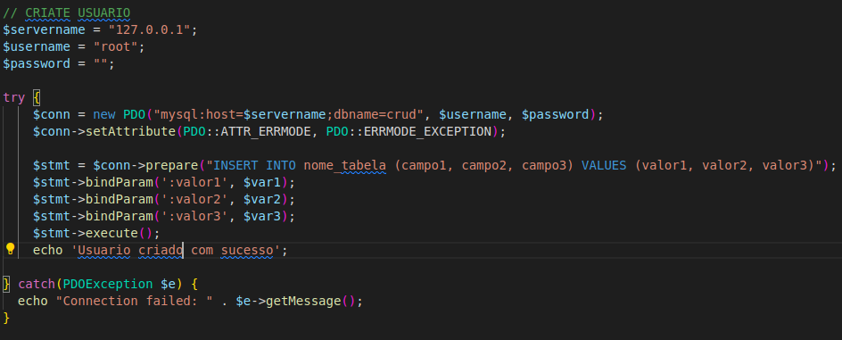
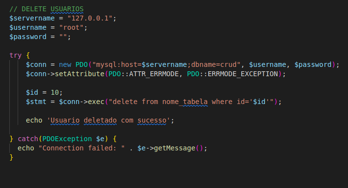

### PHP com MySql
vamos desenvolver um pequeno crud usando php e mysql e o PDO classe do php para conexão de banco de dados


### PDO
O PDO funcionará em 12 sistemas de banco de dados diferentes, enquanto o MySQLi funcionará apenas com bancos de dados MySQL.


Então, se você precisar mudar seu projeto para usar outro banco de dados, o PDO facilita o processo. Você só precisa alterar a string de conexão e algumas consultas. Com o PDO, você precisará reescrever todo o código - inclusive as consultas.


### descrição
Vamos criar crud que contempla a criação de uma tabela de usuários, nessa tabela
vamos criar, fazer buscas, atualizar os dados e deletar os registos de um usuário
apenas o básico para entender o funcionamento de um gerenciamento de crud


### Modelagem do Banco de dados
```sql
-- criar tabela de usuario
create table users(
    id int not null auto_increment primary key,
    firstname varchar(255),
    nickname varchar(200) unique not null,
    password varchar(200) not null
);


insert into nome_tabela (campos) values(valores);


select * from nome_tabela;


UPDATE nome_tabela SET firstname = 'Pedro Santos' WHERE id=0;

DELETE FROM nome_tabela WHERE id=1;
```


### Abrindo a Conexão 



### Buscar Dados



### Atualizar Dados



### Criar Dados



### Delete Dados


 