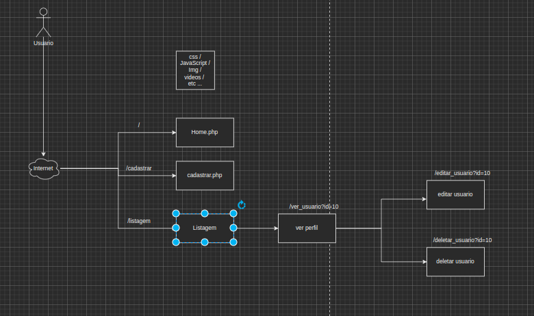
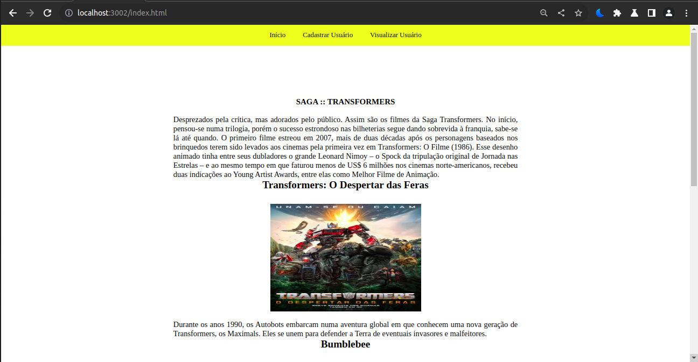
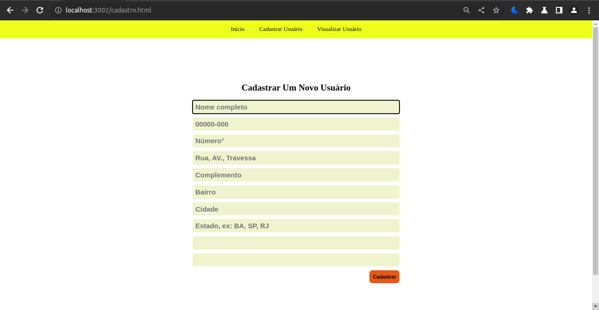
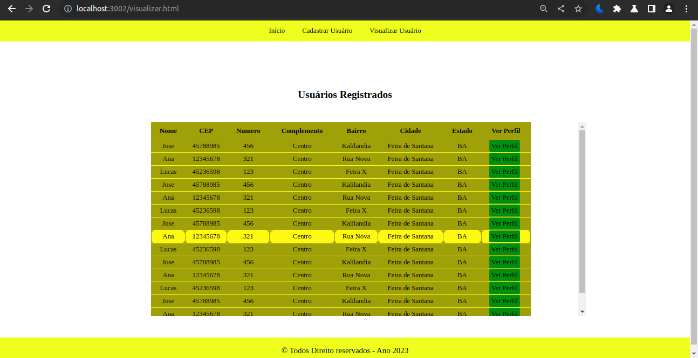
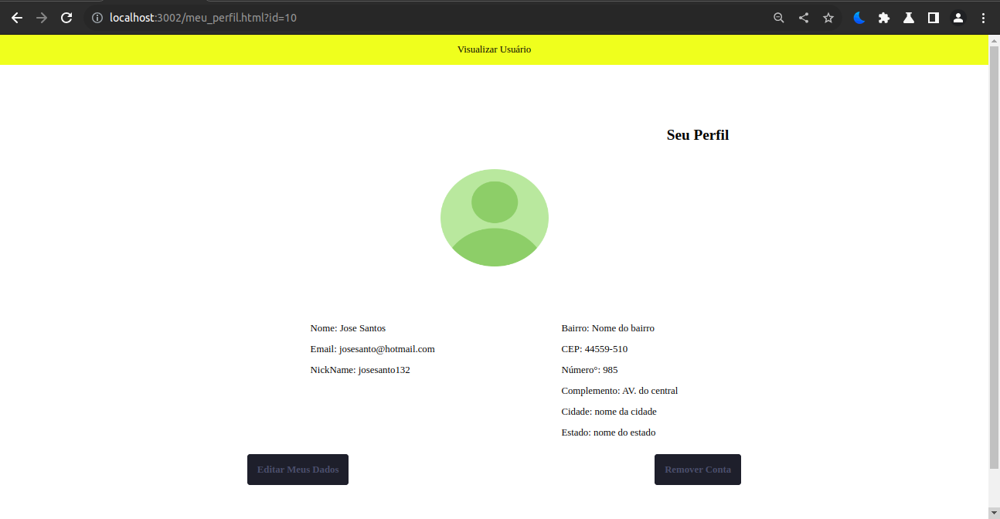
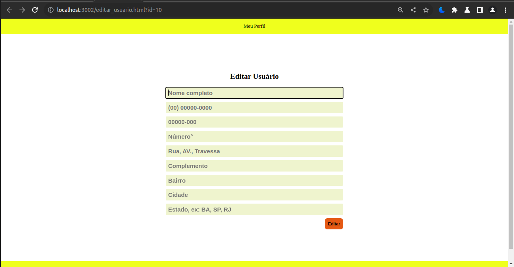

Este projeto visa o aprendizado de conceitos como php e mysql, html, css e javascript
para apresentar o projeto aqui iremos fazer um projeto que tem por principal objetivo 
fazer o gerenciamento de usuarios externos tendo como utilizador o usuario admin

a modelagem do projeto segue a seguinte 

```sql
CREATE TABLE IF NOT EXISTS `usuario` (
  `id` INT(5) NOT NULL AUTO_INCREMENT,
  `nome` VARCHAR(50) NOT NULL,
  `email` VARCHAR(50) NOT NULL,
  `nickname` VARCHAR(50) NOT NULL
  `telefone` VARCHAR(15) NOT NULL
  `cep` VARCHAR(15) NOT NULL,
  `rua` VARCHAR(50) NOT NULL,
  `numero` INT(10) NOT NULL,
  `complemento` VARCHAR(50) DEFAULT NULL,
  `bairro` VARCHAR(50) NOT NULL,
  `cidade` VARCHAR(50) NOT NULL,
  `estado` VARCHAR(50) NOT NULL,
  PRIMARY KEY (`id`)
) ENGINE=InnoDB  DEFAULT CHARSET=utf8;
```


a fim de melhoria dessa modelagem os alunos devem separar as informações contidas na tabela de usuario 
de acordo com as informações contida nela

outro ponto também é a tabela de telefone onde sera aplicado um relacionamento de 1 para n analise com essas duas tabelas foram desenvolvida e aplicar uma melhoria para o correto e melhor funcionamento do sistema de gerenciamento de usuários


vamos entender como o nosso sistema vai funcionar




Páginas do site:

### Page Home


### Page Cadastro


### Page Listagem


### Page Meu Perfil


### Page Editar


