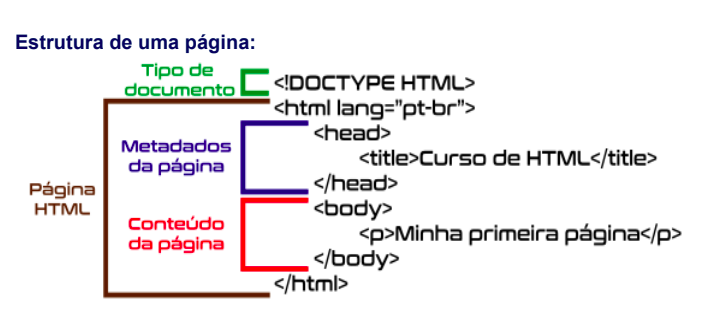
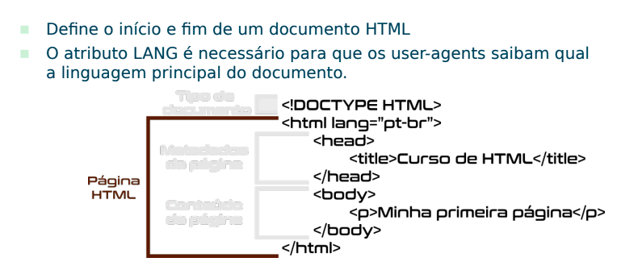
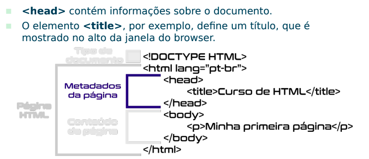
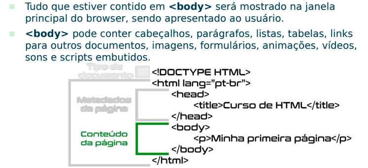

## Objetivos da aula:

<ol>
    <li>Aprender os conceitos básicos e fundamentos do HTML5</li>
    <li>Entender o funcionamento de parágrafos, listas, tabelas</li>
    <li>Conhecer outras possibilidades de formatação</li>
    <li>Manipular hiperlinks, imagens e formulários</li>
    <li>Kahoot</li>
    <li>Apresentar a evolução do projeto</li>
    <li>Revisar conceitos de função</li>
    <li>Funções isset e empty</li>
</ol>


### O que é HTML
HTML é uma abreviação para "HyperText Markup Language" (linguagem de marcação de hipertexto)
que é utilizada para produzir páginas na web.

Ela estabelece como um determinado elemento deve ser visualizado, não sendo, portanto, uma linguagem de
programação, e sim uma linguagem de formatação de conteúdo.


#### Como funciona uma página?


#### Estrutura da página HTML



#### Tag HTML



#### Tag Head 



#### Body



#### Entendemos cada uma das tags que repesenta a estrutura básica de uma página html

Aqui é passado para o navegador web o tipo do contéudo que está em meu documento de texto
```html
<!DOCTYPE html>
```

A tag **html** é a raiz de todo o documento HTML é aqui que damos inicio ao nosso objeto DOM
```html
<html></html>
```


```html
<head></head>
```

#### Elemento HTML é tudo que está entre a tag inicial e a tag final do arquivo 


#### Exemplo das principais tags HTML utilizadas para estruturar uma página de um site:


<table>
    <tr>
        <th>TagName</th>
        <th>Descrição</th>
    </tr>
    <tr>
        <td>p</td>
        <td>Tag usada para escrever um paragrafo</td>
    </tr>
    <tr>
        <td>ul</td>
        <td>Tag usada desenvolver listas</td>
    </tr>
    <tr>
        <td>form</td>
        <td>Tag usada desenvolver formulários</td>
    </tr>
    <tr>
        <td>table</td>
        <td>Tag usada desenvolver tabelas, e possui subtags como <b>thead</b>,<b>tbody</b> e <b>tfooter</b> </td>
    </tr> 
    <tr>
        <td>nav</td>
        <td>Tag usada desenvolver menu de navegação entre páginas</td>
    </tr>
    <tr>
        <td>div</td>
        <td>Tag usada desenvolver blocos de contéudo dentro das páginas</td>
    </tr>
    <tr>
        <td>h1</td>
        <td>Tag usada desenvolver titulos, sendo que h1 é o titulo mais prioritário e o h6 de menor prioridade</td>
    </tr>
     <tr>
        <td>a</td>
        <td>Tag usada desenvolver os link essa tag é também chamada de anchor/ancora</td>
    </tr>
      <tr>
        <td>img</td>
            <td>Tag usada para adicionar imagens na página
        </td>
    </tr>
     <tr>
        <td>video</td>
            <td>Tag usada para adicionar um video a página
        </td>
    </tr>
     <tr>
        <td>audio</td>
            <td>Tag usada para adicionar um audio ou musica, um uso comun seria uma play lista de musicas
        </td>
    </tr>
</table>


#### Como escrever uma tag HTML


### Atributos de um elemento HTML


 


<p>Referencia ou documentação sobre o <a href="https://www.w3schools.com/html/default.asp" target="_blank">HTML</a></p>


